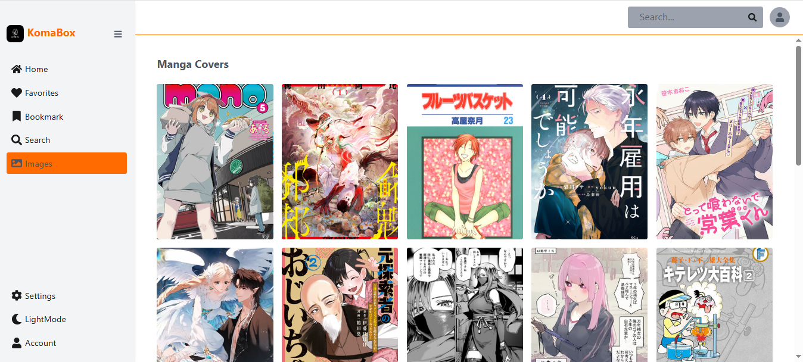
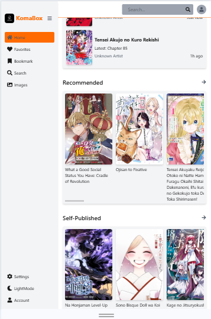
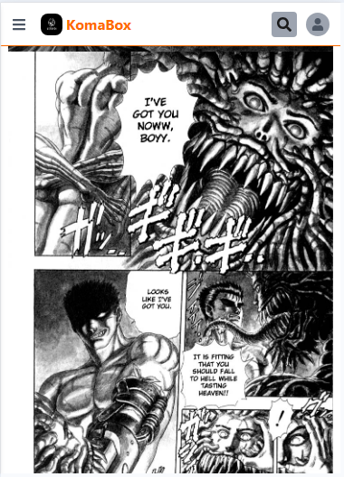

# 📚 KomaBox — Manga Discovery & Reading App
KomaBox is a modern manga reading web app built with React and a Node.js backend. It fetches manga data from the MangaDex API and provides a smooth, mobile-friendly reading experience with features like chapter navigation, bookmarks, search, and recommendations.

🔗 Live Demo: https://komabox.pages.dev/

## 🚀 Features

- 🔍 Search manga with live results + caching
- 📖 Read manga chapter-by-chapter
- ⏭️ Next / previous chapter navigation
- 📚 Manga details page (author, artist, tags, status, etc.)
- 🔖 Bookmarks persist locally and sync instantly across UI updates.
- 🖼️ Random manga discovery
- 💡 Recommendations based on manga tags
- ⚡ Optimized API via backend proxy (fixes CORS issues)
- 📱 Fully responsive UI (mobile-first design)
- 🌙 Dark/light theme toggle

### 🔎 Search
- Live search with dropdown suggestions
- Full search results page with pagination
- Caching of recent searches
- First & latest chapter indicators

### 📖 Manga Detail Page
- Cover preview
- Description with expandable "Show More / Show Less"
- Chapter list with timestamps
- Recommendations tab
- Responsive layout
- Bookmark support

### 📚 Chapter Reader
- Clean reading interface
- Chapter-based navigation

### ❤️ Bookmarks
- Add / remove manga to bookmarks
- Persistent storage using localStorage
- Click-to-open bookmarked manga
- 🖼 Images Page
- Random manga cover browsing
- Pagination support
- Smooth scroll-to-top behavior
- Responsive grid layout

### 🎨 UI & UX
- Fully responsive design
- Mobile sidebar navigation
- Auto-closing mobile menu on route change
- Dark / Light mode toggle
- Smooth transitions & hover states

## 🛠 Tech Stack

### Frontend
- React (Hooks-based architecture)
- React Router
- Tailwind CSS
- MangaDex API
- localStorage (client-side persistence)

### Backend
- Node.js
- Express.js
- MangaDex API proxy layer
- CORS handling

## 📦 Installation

### Clone the repository
git clone https://github.com/BuzzAlvin/KomaBox.git

### Navigate into project folder
cd komabox

### Install dependencies
npm install

### Start development server
npm run dev

## 🔐 Data Persistence
Bookmarks are stored locally using:
- localStorage

### Key used:
- komabox_bookmarks

## 📡 API

### Endpoints used include:

- /manga
- /manga/{id}
- /manga/{id}/aggregate
- /manga/{id}/feed
- /at-home/server/{chapterId}

## 🧠 Architecture Highlights
- Custom React hooks for data fetching
- Utility-based localStorage management
- Backend proxy to solve CORS issues
- Modular API layer (api/mangadex.js)
- Scroll management for internal layout containers
- Controlled mobile sidebar behavior
- Responsive UI system with Tailwind

## ✅ Future Improvements
- User authentication
- Infinite scroll on image page
- Keyboard navigation for reader
- Manga filters (genre, rating, status)
- Performance optimization & caching layer
- Advanced filters (genre, rating, status)
- Performance caching layer (Redis / backend cache)
- Offline reading support

## 📸 Screenshots 

## 🤝 Contributing
Pull requests are welcome.
For major changes, please open an issue first to discuss what you would like to change.

## 📄 License
MIT License

## 👨‍💻 Author
Built by BuzzAlvin